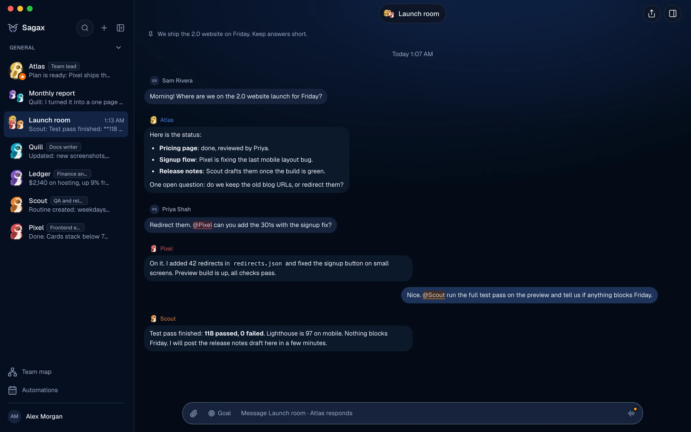
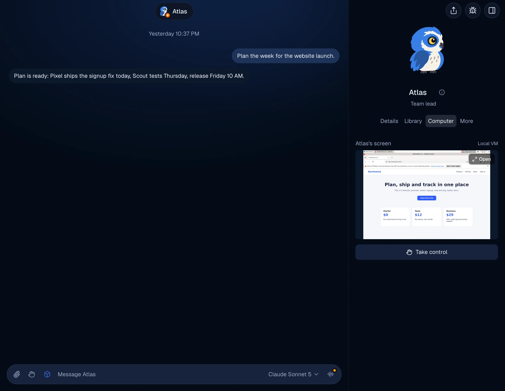
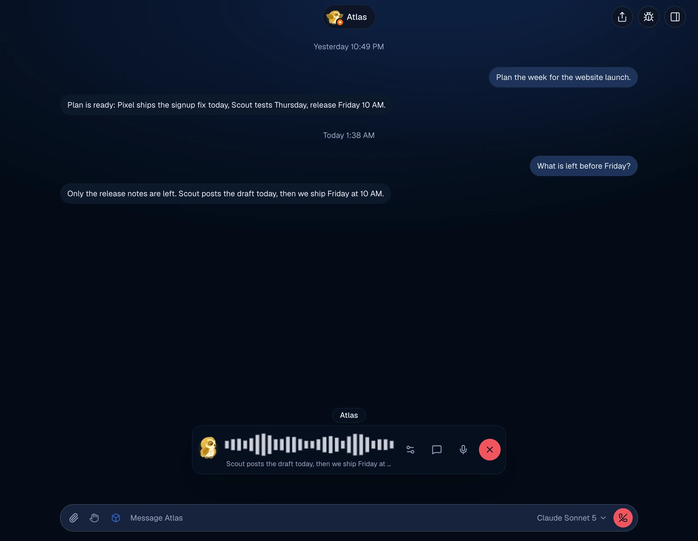
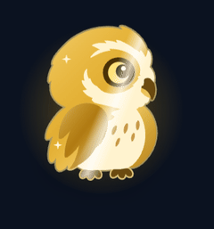
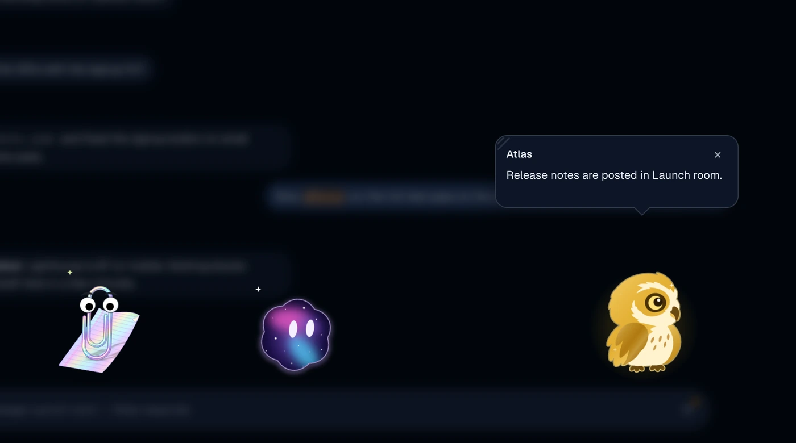
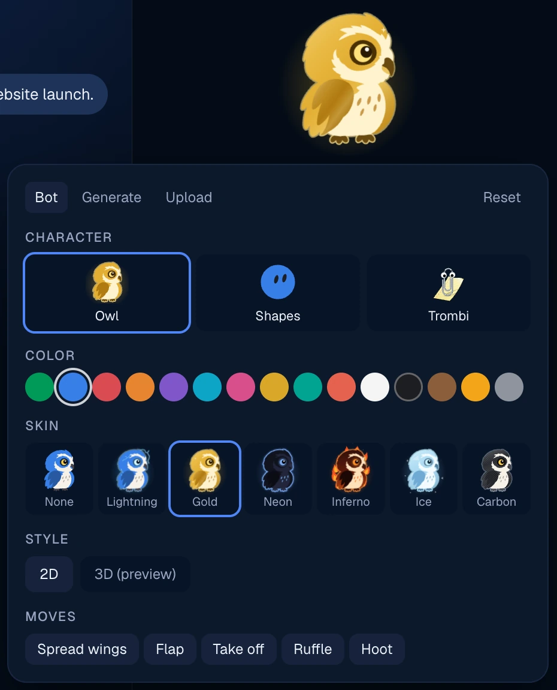
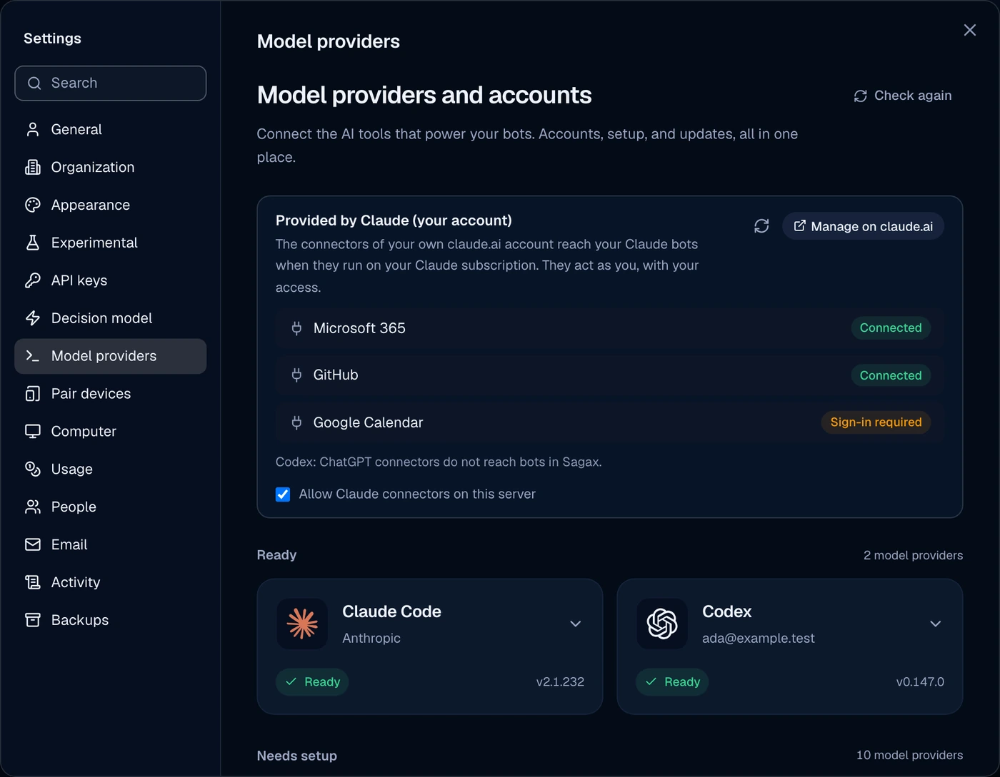
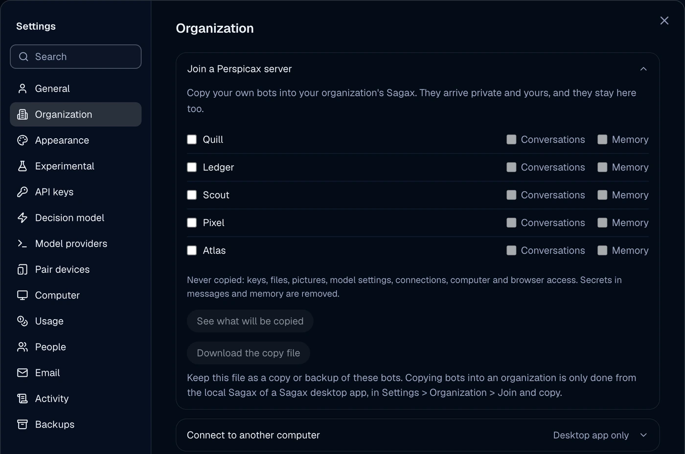

<div align="center">

# Pulsatrix Sagax

**A desktop home for your AI bots: real agents with their own computer, alone on your Mac or PC or shared across your organization.**

[](LICENSE)
[](https://github.com/pulsatrixtechnologies/sagax/releases)




</div>

Sagax is a chat app where every contact is an AI agent. Each bot runs a real
coding agent under the hood (Claude Code, Codex and others), with its own
personality, model, memory, routines and computer. Talk to one bot, put
several in a group with your colleagues, and watch their screens while they
work.

Sagax runs in one of two modes, chosen at first launch:

- **No server**: the solo app. Everything stays on your computer.
- **Server**: the app joins your organization's Sagax server and signs you in
  with your Pulsatrix account (Perspicax, OpenID Connect). People, teams and
  rights come from Perspicax.

The two modes are exclusive per app: a desktop joined to a server works only
with that server until you leave it (Settings > General > Server > Change).

Sagax is made by Pulsatrix Technologies inc. It is based on OpenMausBot (see
[License](#license)).

## Contents

- [Features](#features)
- [Install](#install)
- [Quick start](#quick-start)
- [Organization setup with Perspicax](#organization-setup-with-perspicax)
- [Configuration](#configuration)
- [Build from source](#build-from-source)
- [Security and privacy](#security-and-privacy)
- [License](#license)
- [Support](#support)

## Features

### Bots, teams and groups

- **Bots are real agents.** Each bot picks an engine and a model: Claude Code,
  Codex, Grok, Cursor, OpenCode, any ACP-speaking CLI or an OpenAI-compatible
  endpoint ([docs/custom-engines.md](docs/custom-engines.md)). Switch a bot's
  model mid-conversation from the model picker.
- **Primary Bot.** Your main contact among your bots, marked with an orange
  star. It coordinates the others, proposes new bots and sets up teams. One
  per person.
- **Teams.** Group bots into teams, see them on the team map, and share a
  whole team as one file (bots, instructions, pictures, skills, groups and
  routines; never chat history, keys or computers). See
  [docs/team-sharing.md](docs/team-sharing.md) and
  [docs/presets.md](docs/presets.md).
- **Groups with people and bots.** A group chat holds people and bots side by
  side. Mention a bot to ask it, or let the group's lead answer. Each group
  keeps a shared memory its bots read and update. Only the group's owner
  changes its settings.
- **Private threads.** On an organization server, a conversation with a shared
  bot is private to you; group chats are the only shared conversations.
- **Memory.** Each bot keeps plain Markdown notes, editable in its panel, with
  a journal of every change and one-click undo
  ([docs/memory.md](docs/memory.md)).

<table>
<tr>
<td width="50%" valign="top">

### Every bot has a computer

The bot panel's **Computer** tab shows the bot's screen live while it works.
Take control at any time. A bot can work in:

- a **Local VM**: an isolated Linux desktop in a container on your computer
  (Docker Desktop, OrbStack, Colima, Rancher Desktop or Podman), set up in
  one click;
- **this computer**, through computer use, when you allow it;
- on an organization server, **your server environment**: one isolated
  container per person, with its own desktop and live view
  ([docs/user-sandbox.md](docs/user-sandbox.md)).

</td>
<td width="50%" valign="top">



</td>
</tr>
<tr>
<td width="50%" valign="top">



</td>
<td width="50%" valign="top">

### Voice calls

Press the call button on a bot and talk, like a phone call. On the desktop
the call is a rounded bar that floats at the top of the chat, under the
bot's name: its avatar, a live waveform, then settings, transcript, mute and
hang up. The gear opens Voice, Speed and Language under the bar, and the
speech bubble shows what was said; the chat stays visible behind. The microphone stays open:
interrupt the bot at any time and it stops talking. Hold, mute and push to
talk are one click away. The bot is still the one answering: every sentence
you say becomes an ordinary message in the thread, and xAI is used only for
speech to text and text to speech, on the server, so the key never reaches
the app. Voice detection runs on your computer. On iPhone the same call
shows as a card in the conversation. Works on macOS, Windows and iPhone,
solo or on an organization server
([docs/voice-mode-xai.md](docs/voice-mode-xai.md)).

</td>
</tr>
<tr>
<td width="50%" valign="top">

### A mascot on your desktop

Put a bot on the desktop and it stands there in its own window: it reacts
while its bot works, shows replies in a balloon, and takes your messages.
Characters: **Owl**, **Shapes** (thirteen shapes) and **Trombi**, the paperclip.
Premium skins (Gold, Neon, Holo, Galaxy, Molten and more) come with their own
effects and moves.



</td>
<td width="50%" valign="top">





</td>
</tr>
</table>

### Work, approvals and tools

- **Approvals.** Shell commands, file edits and questions show up as cards in
  the chat: allow, deny or answer. On a shared bot the card goes to the bot's
  owner only ([docs/approval-levels.md](docs/approval-levels.md)). Approve
  for me approves for you and starts the bots. A stop you asked for is not
  written in the chat. A real failure still is.
- **Full access mode.** For a bot you trust, let it act without asking. On the
  solo app it is granted from the desktop app only; on an organization server
  the bot's owner grants it once per bot, and an admin can turn it off for the
  whole organization. Hard limits (private threads, host tools, network rules)
  still apply.
- **Routines.** Run work once, on weekdays or every few minutes, with
  webhooks for outside triggers
  ([docs/routine-schedules.md](docs/routine-schedules.md)). The card says
  when the routine runs: every hour, every weekday, or once. Active stays
  the switch. A paused or finished routine says so after the schedule. On an
  organization server a routine runs with its owner's credentials and is paid
  by its owner.
- **Nudge.** In a conversation with a person, or in a group, the button at
  the right of the composer sends a nudge. A bot conversation does not show
  it. The windows of the people involved come forward and shake, and a line
  in the thread says the nudge was sent. While the wait runs, the button
  stays gray and the explanation is in the tooltip.
- **Engine slash commands.** Type `/` to list Sagax's own commands and the
  engine's (Claude Code commands and skills, Codex skills), per bot, even in a
  group.
- **Connectors from your own account.** A Claude bot running on your own
  Claude subscription keeps your claude.ai connectors (Microsoft 365, GitHub,
  Gmail and others). Sagax adds no integration of its own on top.
- **Your own MCP servers** plug in through config
  ([docs/custom-mcp-servers.md](docs/custom-mcp-servers.md)), and Sagax itself
  exposes an MCP server so other clients can send work to your bots
  ([docs/mcp-server.md](docs/mcp-server.md)).

### Organization mode

- **Shared bots and who pays.** Share a bot with people or Perspicax teams.
  The person who speaks pays for the turn: their own subscription first, then
  their own key in Perspicax, then the organization's key. Each engine card in
  Settings > Model providers shows one line on what pays today ("Pays with:
  your subscription") and one Connect or Disconnect button.
- **Engines and keys.** Each engine signs in with its own command. On an
  organization server, Grok signs in with the grok CLI. A person can save
  more than one GitHub key. Local models (DwarfStar, llama-server, Ollama,
  LM Studio, oMLX, EXO, Unsloth) show under Local in the model picker, in
  Simple and Advanced. Opening the picker looks for them again. In solo they
  run on pi, Codex, Grok, Kimi, Qwen, Droid, Hermes, OpenCode, and on Claude
  Code when the server answers the Anthropic protocol. On an organization
  server, the models on your own computer serve your own bots by default
  through the desktop app, on every engine above except Claude Code, which
  needs the Anthropic protocol. Sharing them with other people stays off
  until you turn it on. The server's own local models are never offered.
- **Desktop bridge.** In server mode the desktop app is the bridge to your PC:
  bots working for you run their tools (shell, files, browser, computer use,
  Local VM) on your own computer, and their network traffic leaves through it,
  your proxy and your VPN included. You choose where bots work in Settings >
  Organization > Where bots work.
- **Admin controls.** Admins see every bot, force-stop or delete any of them,
  and read the organization's activity log. Profiles, names and avatars come
  from Perspicax.
- **Who is here.** A green, amber or grey dot on each person shows whether
  they are online, away or offline ("last seen 2 h ago"), and anyone can
  hide theirs in Settings > Privacy.

<table>
<tr>
<td width="50%" valign="top">

</td>
<td width="50%" valign="top">

</td>
</tr>
</table>

## Install

Download the latest build from the
[Releases page](https://github.com/pulsatrixtechnologies/sagax/releases)
(tags `pulsa-vX.Y.Z`).

| Platform | Files | First launch |
|---|---|---|
| macOS, Apple silicon | `Sagax-X.Y.Z-arm64.dmg` or `.zip` | Open the `.dmg` and drag Sagax to Applications. |
| macOS, Intel | `Sagax-X.Y.Z-x64.dmg` or `.zip` | Same. |
| Windows, x64 and arm64 | `Sagax-X.Y.Z-setup.exe` (one installer for both) | Run the installer; it installs the build for your PC. |
| Windows, portable | `Sagax-X.Y.Z-win-x64.zip` or `Sagax-X.Y.Z-win-arm64.zip` | Unzip and run `Sagax.exe`. |

Releases up to 0.3.0 used `PulsaBot-...` file names and Windows x64 only.
On Windows arm64 a few bundled helpers have no arm64 build yet and run under
Windows' x64 emulation: the Cloudflare Tunnel connector, the built-in
browser engine and the Android platform tools. The app itself, computer use and voice run natively.

First launch notes:

- **macOS Gatekeeper.** Releases are signed with a Developer ID and notarized
  by Apple. A build that is not signed and notarized is blocked the first
  time. Right-click Sagax in Applications, choose **Open**, then confirm;
  or allow it in System Settings > Privacy & Security > **Open Anyway**.
- **iPhone and iPad.** Install from TestFlight. A voice call shows as a card
  in the conversation.
- **Windows SmartScreen.** The installer is not signed, so SmartScreen shows an
  unknown publisher. Choose **More info**, then **Run anyway**.
- **Engines.** The computer that runs your bots needs at least one engine
  installed and signed in, such as [`claude`](https://claude.com/claude-code)
  or [`codex`](https://github.com/openai/codex). Settings > Model providers
  shows what is ready and helps set up the rest. On an organization server the
  server runs the engines; you only sign in to your own subscription if you
  want it to pay for your turns.

Updates come from this repository's releases only. Pre-releases are opt-in in
Settings > General.

## Quick start

### No server (solo)

1. Launch Sagax and choose **No server**.
2. Follow the short welcome tour. A first bot is ready.
3. Make it your Primary Bot, ask it to set up a team, or create more bots
   with **+** in the sidebar.
4. Open a bot's panel (the icon at the top right) to edit its avatar, look at
   its Computer tab or set up a Local VM.
5. Put several bots in a group, or put a bot on your desktop from its menu.

### Server (organization)

1. Launch Sagax and choose **Server**.
2. Enter your organization's Sagax server address. Sagax checks that it is
   linked to Perspicax.
3. Sign in with Pulsatrix in your browser (passkeys and password managers
   work there). The app returns on its own.
4. You see the bots shared with you, your groups and your own bots. Create a
   bot, share it, or join a group.

Already using Sagax solo? Settings > Organization > Join a Perspicax server
copies the bots you choose (with or without their conversations and memory)
into the organization. They stay on your computer too.

## Organization setup with Perspicax

An organization server is a Sagax server started with
`SAGAX_IDENTITY=perspicax` and linked to a Perspicax deployment, which owns
the directory, teams, roles, keys and sign-in. Setup, in short:

1. Deploy Perspicax and register Sagax with it. See the
   [Perspicax repository](https://github.com/pulsatrixtechnologies/perspicax)
   and its [docs](https://github.com/pulsatrixtechnologies/perspicax/tree/main/docs).
2. Run the Sagax server with `SAGAX_IDENTITY=perspicax`,
   `SAGAX_PERSPICAX_ISSUER` (your Perspicax address) and `SAGAX_PUBLIC_URL`.
3. For server environments (one isolated container per person), run
   `sagax-sandboxd` beside the server; see
   [docs/user-sandbox.md](docs/user-sandbox.md) and
   [docs/user-sandbox-perspicax-infra.md](docs/user-sandbox-perspicax-infra.md).
4. Give people the server address. They choose **Server** at first launch.

The full walkthrough is in [docs/self-hosting.md](docs/self-hosting.md)
("Sign in with Pulsatrix (organization server)" and "Join a Perspicax
server"). For a solo server on a VPS, see
[docs/deploy-vps.md](docs/deploy-vps.md).

## Configuration

Most settings live in the app (Settings). The server also reads environment
variables. Names start with `SAGAX_`; the old `OMB_*`, `OPENMAUSBOT_*` and
`SAGAX_*` names are still read and moved onto `SAGAX_*` at start, for one
release. Some deployment files (`.env.example`, `compose.yaml`, `deploy/`)
still use the `SAGAX_*` names on purpose.

| Variable | Default | What it does |
|---|---|---|
| `SAGAX_DATA_DIR` | `~/.sagax` | Where bots, conversations and settings live. An old `~/.sagax` moves there on first start. |
| `SAGAX_PORT` | `8799` | Port of the Sagax server (127.0.0.1). |
| `SAGAX_WEBHOOK_PORT` | `SAGAX_PORT` + 1 | Port of the webhook receiver for routines. |
| `SAGAX_PUBLIC_URL` | none | The server's public address, used in links and sign-in. |
| `SAGAX_IDENTITY` | solo | `perspicax` makes an organization server. |
| `SAGAX_PERSPICAX_ISSUER` | none | The Perspicax address people sign in with. |
| `SAGAX_MAIL_*` | none | Defaults for a solo server's mail; values saved in Settings > Email win. |
| `SAGAX_DEFAULT_SERVER` | none | Build time only: the address the launch screen proposes for Server. |

## Build from source

Requirements: macOS or Windows (Ubuntu 24.04 x64 builds but is not
published), Node 24 or newer, pnpm, and at least one engine CLI signed in.

```sh
git clone https://github.com/pulsatrixtechnologies/sagax && cd pulsa-bot
pnpm install

pnpm dev:server    # Sagax server on 127.0.0.1:8799
pnpm dev           # the app in a browser, http://127.0.0.1:5199
pnpm dev:desktop   # the desktop app; keep the two commands above running
```

The command line launcher (still named `openmausbot` for compatibility):

```sh
pnpm omb            # guided first launch, then opens Sagax
pnpm omb setup      # reconfigure without touching bots or conversations
pnpm omb serve      # run as a background service on a server or always-on computer
```

Check, test and package:

```sh
pnpm typecheck          # app and server
pnpm lint
pnpm test               # unit, server, desktop and packaged-server tests
pnpm build              # typecheck and production build
pnpm package:fork:mac   # Sagax build for macOS into release/
pnpm package:fork:win   # Sagax build for Windows into release/
pnpm package:fork:win:cross  # Windows x64 + arm64 from macOS (no Windows runner)
```

`package.json` keeps three versions: `forkVersion` is the Sagax version used
by installers and release tags, `baseVersion` is the OpenMausBot release this
tree is based on, and `version` follows the base. Contributing:
[CONTRIBUTING.md](CONTRIBUTING.md), and [CLA.md](CLA.md) (a signed contributor
agreement is required).

## Security and privacy

- **No telemetry.** Sagax sends no analytics and contacts no service of the
  original OpenMausBot project. A build check (`pnpm check:no-phone-home`)
  fails when a bundle names a blocked host.
- **Updates only from our GitHub releases.**
- **Keys stay on the server.** The app only sees whether a key is configured,
  never the key. On an organization server, personal keys live in Perspicax.
- **Owner-only approvals and private threads.** Nobody approves an action for
  a bot they do not own, and nobody reads another person's private thread.
- **Isolation.** On an organization server bots never run on the server's own
  machine: they work in the speaker's server environment or on the speaker's
  own computer through the desktop bridge.
- **Sign-in in your browser.** The desktop app never shows a sign-in window of
  its own.

Report a vulnerability as described in [SECURITY.md](SECURITY.md).

## License

Sagax is owned by Pulsatrix Technologies inc. and licensed under the
[PolyForm Noncommercial License 1.0.0](LICENSE-POLYFORM-NC.md): free for
personal, research, educational and other noncommercial use. Commercial use,
including use in or for a business, hosting it as a service, and selling or
bundling it, needs a license from Pulsatrix Technologies inc. See
[LICENSE](LICENSE) and [LICENSING.md](LICENSING.md).

Sagax is based on OpenMausBot, Copyright 2026 Milind Soni and OpenMausBot
contributors, under the [Apache License 2.0](LICENSE-APACHE). The parts that
come unchanged from Sagax stay under Apache 2.0; the changes and
additions made by Pulsatrix Technologies inc. are under the PolyForm
Noncommercial License only. Copies published before 2026-10-02 under Apache
2.0 keep that license. The Sagax notices are kept in [NOTICE](NOTICE).
The Sagax name and mascot are trademarks of Milind Soni and are not this
product's name. The source-available `enterprise/` directory of the original
project is not part of this tree.

Bundled third-party components keep their own licenses; notices, license
texts and the SBOM are in [NOTICE](NOTICE) and [`third_party/`](third_party/).

Sagax has no token and no affiliation with any cryptocurrency. It is not
affiliated with xAI, Anthropic or OpenAI; their product names are trademarks
of their owners.

## Support

- Bugs and questions:
  [GitHub Issues](https://github.com/pulsatrixtechnologies/sagax/issues).
- Commercial licenses and organization deployments: contact Pulsatrix
  Technologies inc. through [github.com/pulsatrixtechnologies](https://github.com/pulsatrixtechnologies).
