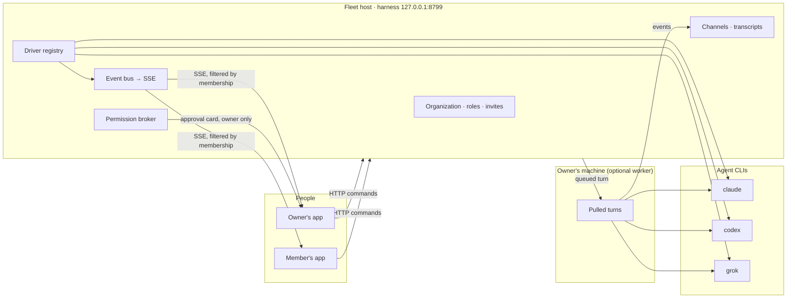

> Sagax has no token and no affiliation with any cryptocurrency.
> It is a modified distribution of the Apache-2.0 project originally published as OpenMausBot.
> It is not affiliated with xAI. "Grok" is a trademark of its owner.

<div align="center">

# Pulsatrix Sagax

<sub>Formerly Pulsa Bot. Sibling of Pulsatrix Perspicax.</sub>

**Your own team of AI bots, in a chat app your whole organization can share.**

<sub>An independent, open-source project inspired by **Grok Bot**: bring-your-own-agent, local-first, on the models you already have. Not affiliated with xAI.</sub>

Every bot is a real agent (Claude, Codex, or Grok running locally under the hood) with its own
personality, model, computer, and connected apps. Invite people into your organization, put bots in
channels, and let everyone work with them. Approvals always stay with the bot's owner.


[](https://github.com/pulsatrixtechnologies/pulsa-bot/releases)


<br>


</div>

---

## What Sagax adds

Sagax starts from OpenMausBot and turns a single-person desktop into a shared workspace.

| Area | Change |
|---|---|
| **Organization** | Create an organization on the fleet host. Invite people by email with a single-use link (valid 7 days, revocable). Roles are `owner`, `admin`, and `member`. |
| **Channels with people** | A channel now holds people (`humanIds`) and bots (`memberIds`) as two separate lists. Members see only the channels they belong to. |
| **Bot ownership** | Every bot has an owner. Only the owner can place a bot in a channel or open a direct thread with someone. An admin cannot do it for them. |
| **Owner-only approvals** | Approval cards go to the bot owner's session only. Other people in the channel see that the bot is waiting on its owner, without an Approve button. Nothing is ever approved on its own. |
| **Workers** | A bot runs on the fleet host or on a machine its owner registered as a worker. The channel transcript always lives on the host. If the worker is offline, the turn waits in a queue and never falls back to the host. If the worker drops mid-turn, the turn fails and keeps the text already written. |
| **Discord-style sidebar** | Organization name at the top, then channels, then a **Direct** area with your own bots and the direct threads others opened to you. Section actions (delete, add or remove bots) live in the right-click menu. |
| **Grok-style interface** | A calmer layout closer to Grok Bot: bordered containers without filled backgrounds, a lighter sidebar, pinned bots with a full context menu, and consistent scaling across screens. |
| **Own version line** | Trial builds for macOS and Windows use their own version, starting at 0.1.0. The base stays pinned to the official OpenMausBot release (currently 0.1.89). |
| **No enterprise code** | The source-available `enterprise/` directory was removed. The server always reports `{"edition":"oss"}`. See [License](#license). |

The design is in [docs/superpowers/specs/2026-09-27-org-channels-design.md](docs/superpowers/specs/2026-09-27-org-channels-design.md).

## Try it

Trial installers are published on the [Releases page](https://github.com/pulsatrixtechnologies/pulsa-bot/releases) under tags named `pulsa-vX.Y.Z`.

| Platform | File | First launch |
|---|---|---|
| macOS (Apple silicon and Intel) | `.dmg` or `.zip` | The app is not notarized. Right-click the app, choose **Open**, then confirm. |
| Windows x64 | `.exe` installer | The installer is unsigned. SmartScreen shows an unknown publisher. Choose **More info**, then **Run anyway**. |

These are trial builds, not official OpenMausBot releases. Ubuntu packages and mobile apps are not published from this fork yet.

You still need at least one agent CLI installed and signed in on the machine that runs the bots:
[`claude`](https://claude.com/claude-code), [`codex`](https://github.com/openai/codex), or [`grok`](https://x.ai/cli).

## Versioning

`package.json` carries three versions:

| Field | Meaning |
|---|---|
| `version` | The upstream OpenMausBot version this tree is based on. It is not bumped by the fork. |
| `baseVersion` | The same official base, recorded explicitly (0.1.89). |
| `forkVersion` | The Sagax version (0.1.0 and up). Installers, artifact names, and the `pulsa-v*` tag use it. |

The **Fork release** workflow (`.github/workflows/fork-release.yml`) is started by hand, builds a chosen branch or commit for macOS and Windows, and publishes a GitHub prerelease. It does not touch the upstream release mirror.

## Organizations and channels

1. **Create the organization** on the fleet host (this computer, or the configured server). The creator becomes `owner`.
2. **Invite people** from the organization screen (the profile row at the bottom of the sidebar). An invite is bound to the invited email and can be used once. An expired, used, or revoked invite says which of the three it is. Someone who is already a member simply returns to the organization.
3. **Create bots.** A new bot stays in your Direct area until you share it.
4. **Share a bot** by placing it in a channel, or by opening a direct thread to one person. Only the owner can do either.
5. **Work together.** Anyone in the channel can talk to a bot and make it work. One turn runs per bot at a time; the next message waits.

| Role | Can do |
|---|---|
| `member` | See their channels and Direct, create bots, place their own bots, leave a channel. |
| `admin` | Everything a member can, plus invite people, create and delete channels, add and remove people. |
| `owner` | Everything an admin can, plus remove admins and delete the organization. There is exactly one. |

Being in a channel never gives access to the owner's files, computer, or keys. Removing a person or a bot from a channel refuses their pending action and closes their composer; history stays. If the fleet host is unreachable, organization channels do not open a composer and the app says the organization is offline. Bots created before the organization keep working on the machine where they run.

The existing **Organization** enterprise connection (models, license, image) is unchanged and stays a separate card on the same screen.

## Features

<table>
<tr>
<td width="50%" valign="top">

### Pick a brain per bot

A model picker with a provider rail: Claude, Codex, and Grok models side by side, defaults marked,
unavailable providers dimmed with the reason. Switch a bot's model mid-conversation.


</td>
<td width="50%" valign="top">

### Every bot gets a computer

Open the Computer panel and the bot's cloud desktop starts on its own, with a live preview while it
works. Take over in your browser, use an isolated Local VM, or point the bot at this computer.


</td>
</tr>
<tr>
<td width="50%" valign="top">

### Bots ask before they act

Shell commands, file edits, and questions surface as inline cards: Allow, Deny, or answer in chat.
In a shared channel, the card appears only for the bot's owner.


</td>
<td width="50%" valign="top">

### Connected apps

A one-click marketplace over Composio Sessions: Gmail, Slack, GitHub, Notion, Linear, and hundreds more.
Connect once, and your bots can use them as tools.


</td>
</tr>
<tr>
<td width="50%" valign="top">

### Manage bots like contacts

Right-click any bot, including a pinned one: pin, mark unread, edit profile, move to a section,
duplicate, copy conversation ID, hide, delete.


</td>
<td width="50%" valign="top">

### Keys once, everything lights up

Paste credentials in App Settings. They persist locally and the provider fleet reloads immediately.
Secrets are write-only: the UI only sees "configured" flags.


</td>
</tr>
</table>

**Also included from the base project:**

- **Teams from one Markdown file.** Import a team package from disk or a public GitHub URL in **Teams → Import**. A review screen shows the bots, the Primary Bot, channels, playbooks, connector checklist, and routines before anything is created. Connections stay off until you approve them and routines arrive paused.
- **Share a team.** Right-click a team and choose **Share team…** to save its bots, instructions, pictures, skills, channels, and routines as one file. Chat history, keys, model choices, and computers never go in. See [docs/team-sharing.md](docs/team-sharing.md) and [docs/presets.md](docs/presets.md).
- **Voice.** Read replies aloud or call a bot. Voices come from ElevenLabs, Fish Audio, Grok (xAI), built-in Mac voices, or a local Chatterbox server. Calls are macOS only. See [docs/voice-mode.md](docs/voice-mode.md).
- **Routines and webhooks.** Run work once, on weekdays, or every 5 to 1,440 minutes. A separate webhook receiver listens on `127.0.0.1:8800` by default (`SAGAX_WEBHOOK_PORT` to change it). See [docs/routine-schedules.md](docs/routine-schedules.md).
- **MCP control plane.** A stdio MCP server lets Claude Desktop, Cursor, and other clients inspect bots and channels, send work, and wait for results. It does not expose approvals, deletion, credentials, or computer lifecycle. See [docs/mcp-server.md](docs/mcp-server.md).
- **Bot memory.** Each bot keeps plain markdown notes in its workspace. **Bot Settings → Memory** shows how much of them loads, edits them without overwriting the bot's own writes, and keeps a journal of every change with one-click undo. See [docs/memory.md](docs/memory.md).
- **Custom engines and tools.** Any ACP-speaking CLI or OpenAI-compatible endpoint plugs in through config ([docs/custom-engines.md](docs/custom-engines.md)), and so do your own MCP servers ([docs/custom-mcp-servers.md](docs/custom-mcp-servers.md)).

## How it works

Two processes on the host. The app sends typed commands over HTTP and folds one SSE event stream into
state. The harness server owns every agent process, the organization, and every channel transcript. A
registered worker runs turns for the bots its owner assigned to it and streams events back to the host.



| Layer | Where | What it does |
|---|---|---|
| Drivers | `server/drivers/` | One per provider: Claude, Codex, and Grok over their local CLIs, plus a cloud-computer agent. Unknown drivers degrade to "unavailable" and never crash the fleet. |
| Harness | `server/harness/` | Registry (configs to live instances) and the event bus every client folds. |
| API | `server/index.ts` | Bots, turns, approvals, organization, invites, channels, model catalog, computers, connectors, config. HTTP and SSE. |
| Voice | `server/tts/` | Speech providers. Cloud keys stay on the harness. |
| App | `src/` | The chat shell. Server-backed store, one reducer, no client-side transports. |
| Desktop | `electron/` | macOS and Windows shells with an embedded harness. |

## Run from source

```sh
git clone https://github.com/pulsatrixtechnologies/pulsa-bot && cd pulsa-bot
pnpm install

pnpm dev:server    # harness server → 127.0.0.1:8799
pnpm dev           # app → http://127.0.0.1:5199
pnpm dev:desktop   # Electron shell; keep the two commands above running
```

Requirements: **macOS or Windows** (Ubuntu 24.04 x64 builds from source but is not packaged by this fork),
**Node 24+**, **pnpm**, and at least one agent CLI installed and signed in.

The data directory is `~/.sagax` (an existing `~/.openmausbot` moves there on first start) and
environment variables start with `SAGAX_` (the old `OMB_*` names are still read for one release).
To keep existing fleets working, some internal names did not change: the command line is still
`openmausbot`. AGENTS.md ("Legacy names kept for compatibility") lists the others.

Run the terminal launcher from the checkout:

```sh
pnpm omb            # guided first launch, then opens Sagax
pnpm omb setup      # reconfigure without resetting bots or conversations
pnpm omb serve      # background service for a server or always-on computer
```

The npm package named `openmausbot` is the upstream project, not this fork.
For servers, see [docs/deploy-vps.md](docs/deploy-vps.md) and [docs/self-hosting.md](docs/self-hosting.md).

Build and test:

```sh
pnpm typecheck          # app + server
pnpm test               # unit, driver, API, and desktop tests
pnpm build              # typecheck + production build
pnpm package:fork:mac   # Sagax trial build for macOS → release/
pnpm package:fork:win   # Sagax trial build for Windows → release/
```

Optional credentials, pasted once in **App Settings**:

| Credential | What it enables | Where to get it |
|---|---|---|
| Composio project key (`ak_…`) | Gmail, GitHub, Slack, Notion, and other apps | [Composio setup](docs/composio.md) |
| Boat API key | An isolated remote Linux computer per bot | [Boat API key guide](https://docs.boat.dev/api-keys) |
| ElevenLabs key | Spoken replies and calls | [ElevenLabs API keys](https://elevenlabs.io/app/settings/api-keys) |
| Fish Audio key | Spoken replies and calls | [Fish Audio API keys](https://fish.audio/app/api-keys/) |
| xAI API key | Grok voices | **Settings → Connections** |

Composio, Boat, ElevenLabs, Fish Audio, and xAI are third-party services with their own terms and charges.

## Status

Early. The organization, channels, ownership, owner-only approvals, and worker routing are on the
`feat/org-channels` branch and covered by server tests. Trial builds exist for macOS and Windows only,
unsigned. Expect rough edges around worker registration, offline hosts, and the new sidebar. Please report
what you find in [Issues](https://github.com/pulsatrixtechnologies/pulsa-bot/issues).

Contributions are welcome. The driver SPI in [`server/contracts.ts`](server/contracts.ts) is small: a new
provider is one file in [`server/drivers/`](server/drivers/) plus a one-line registration. See
[CONTRIBUTING.md](CONTRIBUTING.md) and [CLA.md](CLA.md).

## License

Sagax is a modified distribution of the work originally published as
OpenMausBot. The original work and this distribution are under the
[Apache License 2.0](LICENSE). Copyright 2026 Milind Soni and OpenMausBot
contributors. Those notices are kept in [NOTICE](NOTICE). Details are in
[LICENSING.md](LICENSING.md).

What this distribution changes:

- The product name is Sagax.
- Organizations, people in channels, bot ownership, owner-only approvals, and workers were added.
- The interface was restyled.
- The source-available `enterprise/` directory was removed. It was not
  Apache 2.0, and its license forbade redistribution. That source is not
  included, and its license check was not copied here. With the directory
  gone, the server reports `{"edition":"oss"}`.

If you redistribute Sagax, Apache 2.0 requires you to:

1. Give recipients a copy of the Apache License 2.0 (`LICENSE`).
2. State that you changed the files. [NOTICE](NOTICE) records the changes
   in this distribution. Add your own changes the same way.
3. Keep all copyright, patent, trademark, and attribution notices from
   the source, including `NOTICE` and `third_party/`.
4. Keep a readable copy of `NOTICE` in any distribution that includes one
   (Apache 2.0 section 4(d)).
5. Not use the OpenMausBot name or mascot as your product name. Those
   marks belong to Milind Soni. Apache 2.0 section 6 does not grant
   trademark rights. Naming the original project, to say where the work
   came from, is the use the license allows.

Packaged Cua Driver components keep their upstream MIT, SIL OFL 1.1, MPL-2.0, and other dependency terms.
The notices, license texts, source locations, and SBOM are in
[`third_party/cua-driver/`](third_party/cua-driver/) and ship beside the native runtime.

Sagax is an independent open-source project inspired by Grok Bot. It is
not affiliated with, endorsed by, or associated with xAI. "Grok" is a trademark
of its owner.
